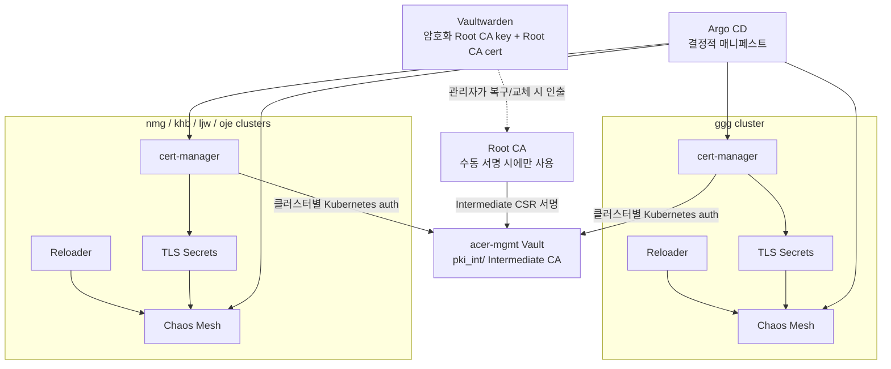

# 중앙 Vault PKI 기반 멀티클러스터 인증서 설계

- 상태: 구현 전 설계 승인 후보
- 작성일: 2026-07-13
- 대상 클러스터: `ggg`, `nmg`, `khb`, `ljw`, `oje`
- 중앙 관리 노드: `acer-mgmt`

## 1. 배경과 문제

현재 Chaos Mesh Helm 차트는 렌더링할 때마다 임의의 `rollme` annotation과 자체 생성 인증서를 만들 수 있다. 같은 Git revision을 다시 렌더링해도 결과가 달라지므로 Argo CD self-heal이 불필요한 rollout과 ControllerRevision/ReplicaSet 누적을 유발한다. 화면에 리소스가 많이 보이는 현상은 Argo CD가 삭제에 실패한 것이 아니라, Kubernetes 컨트롤러가 보존한 rollout 이력과 Chaos Mesh의 CRD를 함께 표시한 결과다.

운영 환경 조사 결과는 다음과 같다.

- `acer-mgmt`의 Vault는 단일 노드 Integrated Storage(Raft) 구성이다.
- 현재 Vault에는 KV 계열 secret engine이 있으며 PKI secret engine은 아직 없다.
- 팀 클러스터별 Kubernetes auth mount와 External Secrets Operator(ESO)의 Vault 연결은 이미 존재한다.
- 팀 클러스터 노드는 각 팀 워크로드 자원이므로 Vault HA voter로 사용하지 않는다.
- 브라우저가 접근하는 `*.imcherry5778.xyz` 인증서는 기존 Let's Encrypt 체계를 유지한다.
- Chaos Dashboard 로그인 token은 Kubernetes ServiceAccount JWT이며 X.509 인증서와 별도 수명주기를 가진다.

## 2. 목표

1. 모든 팀 클러스터의 내부 서비스 인증서를 중앙 Vault PKI 표준으로 발급한다.
2. 각 클러스터의 cert-manager가 인증서 발급·Secret 저장·상태 감시·갱신을 자동 수행한다.
3. 같은 Git revision의 Chaos Mesh 차트는 언제 렌더링해도 같은 매니페스트를 생성한다.
4. 팀별 인증과 서명 권한을 분리하고 한 팀의 권한으로 다른 팀의 인증서를 발급할 수 없게 한다.
5. 평상시 인증서 발급과 갱신에는 사람의 수동 개입이 필요하지 않게 한다.
6. 인증서가 실제로 갱신될 때만 이를 사용하는 워크로드가 안전하게 재시작되게 한다.
7. `ggg` canary부터 점진 배포하고 즉시 되돌릴 수 있게 한다.

## 3. 비목표

- 현재 단계에서 Vault 3노드 HA를 구성하지 않는다.
- 팀 클러스터 노드를 Vault 저장소나 quorum 구성원으로 사용하지 않는다.
- 외부 공개 HTTPS 인증서를 Vault PKI로 이전하지 않는다.
- Chaos Dashboard 로그인 JWT를 인증서 또는 Vault token으로 대체하지 않는다.
- 기존 ESO 애플리케이션 역할을 cert-manager가 공유하지 않는다.

## 4. 확정한 설계 결정

| 항목 | 결정 | 이유 및 트레이드오프 |
|---|---|---|
| Root CA | RSA 4096, 10년, `pathLen=1` | 장기 신뢰 기준점이다. 개인키는 Git/Vault에 저장하지 않는다. |
| Root 보관 | `root-ca.crt`와 암호화한 `root-ca.key`를 self-hosted Vaultwarden에 보관 | 비프로덕션의 비용·운영 편의 절충안이다. 진정한 offline root보다 계정 침해 위험이 크므로 강한 master password, MFA, 백업이 필수다. |
| Vault CA | 공용 Intermediate CA 하나, RSA 3072, 3년, `pathLen=0` | 팀마다 CA를 운영하는 복잡성을 줄이면서 발급 역할과 정책으로 격리한다. |
| Vault 가용성 | 기존 `acer-mgmt` 단일 노드 유지 | 독립 관리 노드가 없어 잘못된 HA보다 명시적인 단일 장애점을 수용한다. Raft snapshot과 복구 훈련으로 보완한다. |
| cert-manager | 각 팀 클러스터에 하나씩 배치 | 클러스터가 인증서 상태와 Secret을 로컬에서 관리하며 중앙 장애 시 기존 인증서로 계속 동작한다. |
| Vault 인증 | 클러스터별 전용 ServiceAccount, Kubernetes auth role, Vault policy | 기존 ESO 역할과 권한을 섞지 않고 최소 권한을 유지한다. |
| 인증서 발급 | 클러스터별 `ClusterIssuer/vault-internal` | 앱 차트가 공통 issuer 이름을 사용하도록 표준화한다. |
| Secret 반영 | Stakater Reloader를 클러스터별 배치하고 대상 워크로드만 opt-in | 인증서 갱신 때만 rollout하며 모든 Secret 변경에 대한 무차별 재시작을 피한다. |
| Chaos Mesh 차트 | 2.8.3 차트를 Git에 vendor하고 비결정적 템플릿 제거 | upstream 변경과 렌더링 변동을 통제한다. |
| rollout 이력 | Deployment/DaemonSet `revisionHistoryLimit: 3` | 장애 분석에 필요한 최근 이력은 남기고 UI 및 etcd 누적을 제한한다. |

## 5. 전체 구조

Vault는 서명 서비스를 제공하고 cert-manager는 Kubernetes 안에서 인증서 수명주기를 실행한다. Argo CD는 이 두 시스템을 대신하지 않으며 선언형 설정만 관리한다.

## 6. PKI 계층과 수명주기

### 6.1 Root CA

- 알고리즘: RSA 4096
- 유효기간: 10년
- Basic Constraints: `CA:TRUE, pathlen:1`
- 개인키: 암호화된 PEM 또는 PKCS#8 형태로 Vaultwarden에 저장
- 인증서: Git에 공개 trust anchor로 저장 가능
- 사용 시점: 최초 Intermediate 발급, Intermediate 교체, 재해 복구

Root 개인키를 생성한 시스템의 임시 파일은 Vaultwarden 저장과 복구 검증이 끝난 뒤 안전하게 제거한다. Root 개인키의 암호는 동일 항목의 일반 메모에 평문으로 함께 저장하지 않는다.

### 6.2 Vault Intermediate CA

- mount: `pki_int/`
- 알고리즘: RSA 3072
- 유효기간: 3년
- Basic Constraints: `CA:TRUE, pathlen:0`
- 개인키: Vault 내부에 생성하고 export하지 않음
- CSR: Vault가 생성하고 Root CA가 수동으로 서명
- 체인: 서명된 Intermediate 인증서와 Root CA 인증서를 Vault에 설정

Intermediate 교체는 만료 180일 전 시작한다. 새 Intermediate와 기존 Intermediate의 신뢰가 겹치는 기간을 두어 leaf 인증서를 순차적으로 재발급한다.

### 6.3 Leaf 인증서

- 기본 유효기간: 90일
- 갱신 기준: 만료 30일 전(`renewBefore: 720h`)
- 기본 키: RSA 2048
- 키 회전: 갱신 시 private key rotation을 활성화
- DNS SAN: 팀별 허용 도메인과 Kubernetes Service DNS 이름만 허용

30일 갱신 여유는 Vault나 네트워크 장애를 복구할 시간을 제공한다. 기존 leaf 인증서는 Vault가 잠시 중단되어도 만료 전까지 계속 유효하다.

## 7. Vault 구성과 팀 격리

### 7.1 PKI role

공용 Intermediate 아래에 팀별 role을 만든다.

- `ggg-internal`
- `nmg-internal`
- `khb-internal`
- `ljw-internal`
- `oje-internal`

각 role은 다음을 제한한다.

- 팀 전용 내부 DNS suffix 및 필요한 Kubernetes Service DNS 이름
- wildcard 사용 여부(기본 금지)
- 최대 TTL 90일
- server/client EKU
- IP SAN 허용 여부(기본 금지)
- 사용자 제공 common name 및 임의 SAN 허용 금지

예를 들어 `ggg-internal` policy는 `pki_int/sign/ggg-internal`의 `update`만 허용하고 다른 팀 role과 CA 관리 endpoint에는 접근할 수 없다.

### 7.2 Kubernetes auth

기존 클러스터별 auth mount를 재사용하되 cert-manager용 role을 별도로 만든다.

| 클러스터 | auth mount | Kubernetes ServiceAccount | Vault auth role | Vault policy | PKI role |
|---|---|---|---|---|---|
| ggg | `kubernetes-ggg/` | `cert-manager/vault-issuer` | `cert-manager-ggg` | `cert-manager-ggg` | `ggg-internal` |
| nmg | `kubernetes-nmg/` | `cert-manager/vault-issuer` | `cert-manager-nmg` | `cert-manager-nmg` | `nmg-internal` |
| khb | `kubernetes-khb/` | `cert-manager/vault-issuer` | `cert-manager-khb` | `cert-manager-khb` | `khb-internal` |
| ljw | `kubernetes-ljw/` | `cert-manager/vault-issuer` | `cert-manager-ljw` | `cert-manager-ljw` | `ljw-internal` |
| oje | `kubernetes-oje/` | `cert-manager/vault-issuer` | `cert-manager-oje` | `cert-manager-oje` | `oje-internal` |

cert-manager는 ServiceAccount의 단기 TokenRequest JWT로 Vault에 로그인한다. 정적 Vault token이나 장기 Kubernetes token을 Git Secret으로 배포하지 않는다. auth role은 ServiceAccount 이름과 namespace를 정확히 bind하고 token TTL을 짧게 설정한다.

### 7.3 관리 권한 분리

- PKI 관리자: mount, CA, role, policy를 변경할 수 있다.
- 클러스터 cert-manager: 자기 팀 PKI role로 서명 요청만 할 수 있다.
- ESO: 기존 KV 경로만 읽으며 PKI 서명 권한이 없다.
- Argo CD: Vault root token이나 Root CA 개인키를 보유하지 않는다.
- 애플리케이션: 발급된 Kubernetes Secret만 mount한다.

## 8. 클러스터 구성

각 팀 클러스터에는 다음 리소스를 GitOps로 설치한다.

1. cert-manager CRD와 controller, webhook, cainjector
2. `cert-manager` namespace의 `vault-issuer` ServiceAccount 및 TokenRequest 참조
3. `ClusterIssuer/vault-internal`
4. 앱별 `Certificate`
5. Root CA trust bundle을 배포하는 ConfigMap 또는 trust-manager 리소스
6. Stakater Reloader와 opt-in annotation

`ClusterIssuer`는 중앙 Vault 주소, 해당 클러스터의 Kubernetes auth mount, auth role, CA bundle을 참조한다. Root CA 인증서는 공개 정보이므로 Git에 둘 수 있지만 fingerprint를 검증하고 변경은 코드 리뷰를 거친다.

인증서 Secret의 이름은 기존 Chaos Mesh가 기대하는 이름으로 고정한다. Secret 매니페스트 자체는 Git에 넣지 않고 `Certificate.spec.secretName`만 선언한다. 따라서 Secret의 `tls.crt`, `tls.key`, `ca.crt`는 cert-manager가 단독 소유하며 Argo CD diff-ignore 대상이 아니다.

Reloader는 인증서를 실제 사용하는 Chaos Mesh controller/daemon에만 annotation으로 활성화한다. 프로세스가 파일 변경을 자체 reload하는지 확인되면 해당 워크로드의 Reloader 의존성을 제거할 수 있다.

## 9. 결정적인 Chaos Mesh 차트

Chaos Mesh 2.8.3 차트를 `acer-argocd` 저장소에 vendor하고 다음 규칙을 적용한다.

- `randAlphaNum`으로 생성되는 `rollme` annotation을 제거한다.
- Helm `genCA`, `genSignedCert` 또는 동등한 렌더링 시점 인증서 생성을 제거한다.
- cert-manager가 만드는 고정 Secret 이름을 참조한다.
- webhook `caBundle`은 cert-manager cainjector가 주입하도록 annotation을 둔다.
- Deployment와 DaemonSet의 `revisionHistoryLimit`을 3으로 설정한다.
- 인증서 관련 Secret 변경만 Reloader가 rollout을 일으키게 한다.
- 같은 chart/version/values로 두 번 렌더링한 출력의 정렬된 hash가 같아야 한다.

Argo CD가 관리하는 MutatingWebhookConfiguration/ValidatingWebhookConfiguration의 `webhooks[].clientConfig.caBundle`은 cainjector가 소유한다. 이 필드에만 resource customization 또는 application-level ignore rule을 적용하고 `RespectIgnoreDifferences=true`를 사용한다. 전체 webhook, Secret data, workload annotation을 넓게 무시하지 않는다. `rollme` 차이는 ignore하지 않고 원인을 제거한다.

## 10. Chaos Dashboard token과 인증서의 경계

`Chaos Dashboard token` 자동화는 Dashboard 사용자가 Kubernetes API에 인증할 때 쓰는 단기 ServiceAccount JWT를 발급한다. Kubernetes API server가 서명하며 기본 수명은 현재 자동화 기준 10분이다.

반면 Chaos Mesh Certificate는 controller, daemon, webhook 사이의 mTLS와 서버 신원 확인에 쓰는 X.509 인증서다. Vault PKI가 서명하고 cert-manager가 갱신한다.

두 체계는 다음처럼 독립적으로 유지한다.

- Dashboard 로그인 JWT: 기존 Semaphore 작업 유지
- Dashboard 외부 HTTPS: 기존 Let's Encrypt 유지
- Chaos Mesh 내부 mTLS/webhook: Vault PKI + cert-manager로 전환

PKI 전환이나 rollback은 Dashboard 로그인 token 발급 로직을 변경하지 않는다.

## 11. Argo CD 애플리케이션 경계와 배포 순서

의존성을 명확히 하기 위해 다음 단위로 애플리케이션을 분리한다.

1. `cert-manager`: CRD와 controller 설치
2. `vault-issuer`: ServiceAccount, RBAC, ClusterIssuer, trust bundle
3. `chaos-mesh-certificates`: Chaos Mesh Certificate 리소스
4. `chaos-mesh`: 결정적 vendor chart와 워크로드
5. `reloader`: 공통 controller 또는 클러스터 공통 add-on

단일 Application 내부 리소스에는 sync wave를 사용할 수 있다. 서로 다른 Application 사이에는 wave만으로 준비 완료를 보장하지 않으므로 ApplicationSet rollout 전략, 명시적 health gate 또는 단계별 sync를 사용한다. `ClusterIssuer Ready=True`와 필요한 `Certificate Ready=True`를 확인한 뒤 Chaos Mesh를 전환한다.

## 12. 마이그레이션 절차

### 12.1 중앙 PKI 준비

1. Root CA를 생성하고 fingerprint와 복구 절차를 기록한다.
2. 암호화된 Root 개인키와 Root 인증서를 Vaultwarden에 저장하고 별도 복구 테스트를 한다.
3. Vault `pki_int/`에서 Intermediate 개인키와 CSR을 생성한다.
4. Root CA로 CSR을 서명하고 체인을 Vault에 설정한다.
5. 팀별 PKI role, policy, Kubernetes auth role을 적용한다.
6. Raft snapshot을 생성해 `acer-mgmt` 외부 위치에 복제한다.

### 12.2 ggg canary

1. ggg에 cert-manager와 Reloader를 설치한다.
2. `ClusterIssuer/vault-internal`의 Ready 상태와 팀 격리를 검증한다.
3. 기존 Chaos Mesh 인증서 Secret을 백업한다.
4. 가능하면 임시 Secret 이름으로 새 체인을 먼저 발급해 내용과 SAN을 검증한다.
5. webhook 신뢰 bundle을 새 Root 체인으로 주입한다.
6. 결정적 Chaos Mesh chart를 새 Secret 참조로 sync한다.
7. controller/daemon이 정상화되고 webhook, mTLS, dashboard 로그인 실험이 성공하는지 확인한다.
8. 강제 갱신에서 인증서당 필요한 rollout이 한 번만 발생하는지 확인한다.
9. 최소 두 번의 Argo refresh/sync 동안 OutOfSync와 추가 revision이 생기지 않는지 확인한다.

### 12.3 나머지 클러스터

ggg 관찰 기간이 끝나면 `nmg → khb → ljw → oje` 순서로 같은 검증을 반복한다. nmg의 기존 Pod Pending은 CPU 부족/노드 affinity 문제이므로 PKI 마이그레이션 성공 조건과 분리해 추적한다.

## 13. Rollback

클러스터별 rollback은 다음 순서로 수행한다.

1. Argo CD에서 해당 클러스터의 Chaos Mesh 자동 sync를 일시 중지한다.
2. 이전 vendor chart revision과 이전 Secret 참조로 되돌린다.
3. 마이그레이션 전에 백업한 기존 인증서 Secret을 복원한다.
4. controller와 daemon을 한 번씩 controlled rollout한다.
5. webhook 호출, mTLS, Chaos Dashboard JWT 로그인을 검증한다.
6. 정상화 후 자동 sync를 다시 활성화한다.

새 `Certificate`와 `ClusterIssuer`는 원인 분석이 끝날 때까지 즉시 삭제하지 않는다. Dashboard token 발급은 이 절차의 대상이 아니다.

## 14. 장애 대응과 운영

| 장애 | 정상 동작 범위 | 대응 |
|---|---|---|
| Vault 일시 중단 | 이미 발급된 leaf 인증서는 만료 전까지 동작 | Vault/네트워크 복구, cert-manager retry 확인 |
| cert-manager 중단 | 기존 Secret은 계속 사용 | controller 복구, Certificate Ready/renewal 확인 |
| `acer-mgmt` 디스크 손실 | 중앙 신규 발급 중단 | off-host Raft snapshot으로 Vault 복구 |
| Vault sealed | 기존 인증서는 동작, 신규/갱신 중단 | 승인된 운영자가 unseal 후 audit 확인 |
| Intermediate 임박/만료 | 신규 발급 위험 | 180일 전 교체 시작, 중첩 신뢰 기간 운영 |
| Root 자료 손실 | Intermediate 이후 CA 교체 불가 | Vaultwarden 및 별도 암호화 백업 복구 시험 |
| 잘못된 팀 policy | 교차 팀 발급 가능성 | deny test와 audit log로 배포 전 차단 |

운영 기준은 다음과 같다.

- Vault Raft snapshot: 매일, `acer-mgmt` 외부 암호화 저장소로 복제
- restore drill: 월 1회 격리 환경에서 수행
- 인증서 알림: 만료 30일, 14일, 7일 전
- 상태 알림: `Certificate Ready=False`, `ClusterIssuer Ready=False`, cert-manager renewal 오류
- Vault 알림: sealed, health 실패, 디스크 사용량, snapshot 실패
- 감사: PKI sign 요청의 팀 role, SAN, caller를 Vault audit log에서 확인

## 15. 검증 계약

### 15.1 정적 검증

- 동일 inputs로 Chaos Mesh chart를 두 번 render한 결과 hash가 같다.
- vendor chart에 `randAlphaNum`, `genCA`, `genSignedCert`가 없다.
- Root CA 개인키와 암호가 Git history 및 Kubernetes Secret에 없다.
- 각 팀 policy가 자기 `pki_int/sign/<team>-internal`만 허용한다.
- cert-manager ServiceAccount와 기존 ESO ServiceAccount/role/policy가 분리되어 있다.
- 공개 HTTPS issuer와 Dashboard token 자동화 파일에는 의도하지 않은 diff가 없다.
- webhook `caBundle` 이외에 광범위한 Argo diff-ignore가 없다.

### 15.2 ggg live 검증

- `ClusterIssuer/vault-internal`이 `Ready=True`다.
- 모든 Chaos Mesh `Certificate`가 `Ready=True`이고 체인이 예상 Root CA fingerprint로 끝난다.
- 인증서 SAN, EKU, TTL이 팀 role 제한과 일치한다.
- 다른 팀 DNS 이름의 인증서 발급 요청이 거절된다.
- Chaos Mesh controller, daemon, webhook mTLS가 정상이다.
- Dashboard의 기존 10분 JWT 로그인이 정상이다.
- 동일 Git revision을 반복 refresh/sync해도 workload revision이 늘지 않는다.
- 강제 인증서 갱신 때 대상 workload만 한 번 rollout된다.
- Vault를 일시적으로 차단해도 기존 workload가 지속되고 복구 후 갱신이 자동 재시도된다.

## 16. 저장소별 구현 경계

### 16.1 `acer-mgmt`

- Root CA 생성·보관·복구 runbook
- Vault PKI Intermediate bootstrap script/config
- 팀별 PKI role, policy, Kubernetes auth role
- Raft snapshot off-host 백업 및 restore 검증
- Vault/PKI 모니터링과 경보

### 16.2 `acer-argocd`

- 클러스터별 cert-manager와 Reloader Application/ApplicationSet
- `ClusterIssuer`, trust bundle, Chaos Mesh `Certificate`
- vendor한 결정적 Chaos Mesh 2.8.3 chart
- webhook `caBundle` 소유권과 제한된 Argo diff 설정
- 이중 render 재현성 테스트와 팀별 구성 검증

두 저장소의 구현은 각각 짧은 작업 브랜치와 별도 구현 계획으로 진행한다. 중앙 PKI 준비가 먼저 완료되어야 하지만, Argo 리소스와 정적 테스트 작성은 병행할 수 있다.

## 17. 완료 조건

- Root CA 자료가 합의한 방식으로 저장되고 실제 복구가 검증되었다.
- Vault Intermediate와 5개 팀 role/policy/auth role이 최소 권한 테스트를 통과했다.
- 5개 클러스터에서 cert-manager가 자동 발급과 갱신을 수행한다.
- Chaos Mesh chart 이중 render 결과가 동일하다.
- ggg canary와 나머지 팀의 mTLS/webhook/dashboard 회귀 검증이 통과했다.
- 인증서 갱신 한 번당 의도한 workload만 한 번 rollout된다.
- Argo CD에 반복적인 OutOfSync나 무의미한 ControllerRevision/ReplicaSet 증가가 없다.
- Vault 단일 노드 장애 및 인증서 만료 경보, snapshot, restore runbook이 검증되었다.

## 18. 향후 HA 전환 조건

독립적인 관리 노드 3대를 확보하면 Vault Integrated Storage를 3 voter HA로 전환한다. 각 노드는 서로 다른 장애 영역과 영속 디스크를 사용하고 load balancer 또는 안정적인 API endpoint 뒤에 둔다. 팀 클러스터 워크로드 노드는 HA 전환 자원으로 계산하지 않는다.

HA 전환 전까지 현재 구조는 "인증서 발급 제어면에 단일 장애점이 있으나, 이미 발급된 인증서는 유효기간 동안 계속 동작하는 비프로덕션 구성"으로 명시한다.

## 19. 참고 문서

- HashiCorp Vault PKI secrets engine 및 Intermediate CA 구성 문서
- cert-manager Vault Issuer와 Kubernetes auth 문서
- Argo CD의 Helm random data 및 diff customization 문서
- Chaos Mesh 2.8.3 Helm chart 원본과 인증서 템플릿
